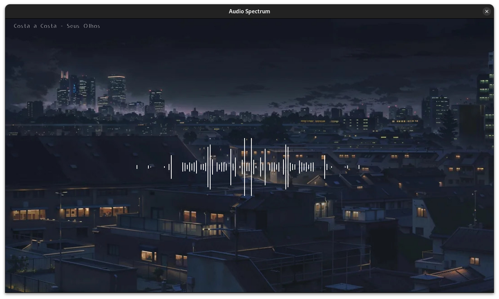

# waveViewer
Audio Spectrum with SFML and FFTW

 

---

## Dependencies
+ C++ compiler: [GNU GCC](https://gcc.gnu.org/)/[Clang](https://clang.llvm.org/)/[MSVC](https://visualstudio.microsoft.com/)
+ [SFML](https://www.sfml-dev.org/)
+ [FFTW](https://fftw.org/)

Example of installing FFTW on Ubuntu:
```bash
sudo apt update
sudo apt install libfftw3-dev
```

---

## Compile and run
```bash
git clone https://github.com/terroo/audio-visualizer
cd audio-visualizer
g++ main.cpp -lsfml-graphics -lsfml-window -lsfml-system -lsfml-audio -lfftw3 
./a.out Music.mp3
```

---
